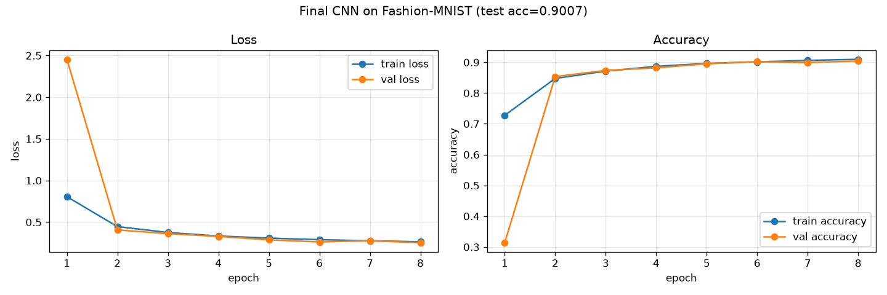
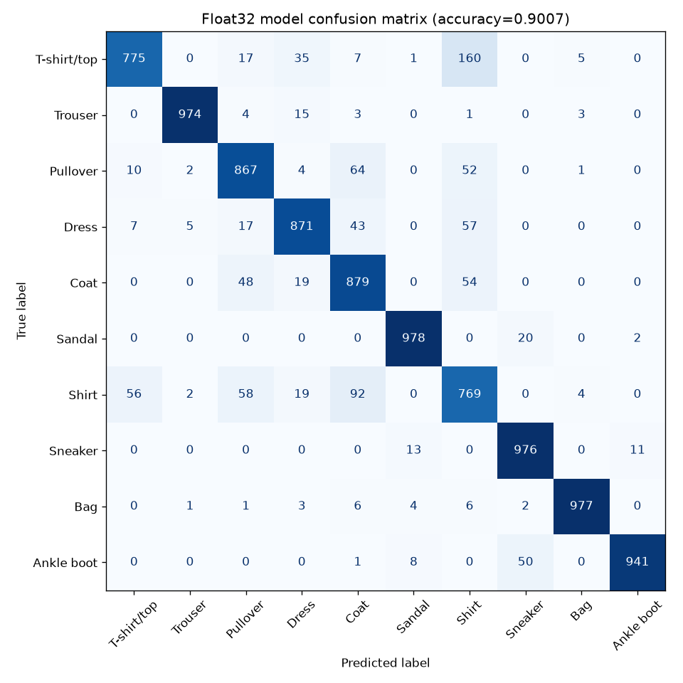
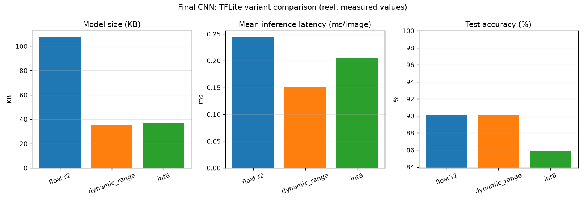

# final-project

## Optimizing and Deploying a CNN Image Classifier on Edge Devices

The capstone of this repository: a complete, real, end-to-end pipeline —
data → model → training → TFLite conversion → benchmark → single-image
inference — rebuilt as a clean standalone `src/` package rather than the
step-by-step exploratory scripts in `tensorflow-basics/` and
`tensorflow-lite/`.

## Structure

```
final-project/
├── src/
│   ├── data.py        - load Fashion-MNIST, normalize, train/val/test split
│   ├── model.py        - CNN architecture (26,154 params)
│   ├── train.py        - training loop, saves model + training curve
│   ├── convert.py      - float32 / dynamic-range / INT8 TFLite conversion
│   ├── benchmark.py    - size, latency, accuracy, confusion matrix
│   └── infer.py         - image path in -> prediction out, via TFLite
├── models/              - cnn_classifier.keras + all 3 .tflite variants
├── results/             - training curve, confusion matrix, comparison chart,
│                          benchmark table (.md + .csv), demo images
└── notebooks/
    └── walkthrough.ipynb - executed walkthrough, outputs saved
```

## How to run the whole pipeline

```bash
python final-project/src/train.py       # trains, saves models/cnn_classifier.keras + results/training_curve.png
python final-project/src/convert.py     # produces models/model_{float32,dynamic_range,int8}.tflite
python final-project/src/benchmark.py   # produces results/ tables, chart, confusion matrix
python final-project/src/infer.py final-project/results/test_sample_correct.png --model final-project/models/model_int8.tflite
```

Or open `notebooks/walkthrough.ipynb` — it loads the already-trained
artifacts and walks through every stage with the real, saved results.

## Architecture

A CNN deliberately designed using the lesson from `tensorflow-basics/README.md`:
that model found a single `Flatten`→`Dense` layer held 90% of all parameters.
This model replaces that pattern with `GlobalAveragePooling2D` (zero
parameters) before the final dense layers, plus one extra convolutional block
and `BatchNormalization` for training stability:

| Metric | tensorflow-basics CNN | final-project CNN |
|---|---|---|
| Parameters | 56,714 | **26,154** |
| Conv blocks | 2 | 3 |
| Head | Flatten → Dense(64) | GlobalAveragePooling2D → Dense(32) |

## Real results

**Training** (8 epochs, `EarlyStopping(monitor="val_accuracy", restore_best_weights=True)`):

A first real run without early stopping showed validation accuracy was
unstable epoch to epoch (it crashed to 0.35 on epoch 1 from BatchNorm still
calibrating its running statistics, then bounced between 0.84–0.90, and the
*last* epoch was not the best one). Added `EarlyStopping` with
`restore_best_weights=True` so training always keeps the best-performing
snapshot rather than whatever the final epoch happened to produce — a real
engineering decision made because the problem was actually observed, not a
generic best practice applied blindly.

**Final test accuracy: 0.9007** (beats the simpler `tensorflow-basics` CNN's
87.45%, with fewer than half the parameters).



**Confusion matrix** (float32 model, full 10,000-image test set):



The expected Fashion-MNIST confusion cluster shows up clearly: Shirt,
T-shirt/top, Pullover, and Coat are confused with each other far more than
with anything else — these classes genuinely look similar at 28×28
grayscale resolution.

**TFLite benchmark** (from `results/benchmark_table.md`, real measurements,
200 timed runs after 20 discarded warmup runs):

| Model | Size (KB) | Accuracy | Mean latency (ms/image) |
|---|---|---|---|
| float32 | 107.32 | 0.9007 | 0.2439 |
| dynamic_range | 35.42 | 0.9014 | 0.1517 |
| int8 | 36.41 | 0.8589 | 0.2056 |



**A real, more pronounced tradeoff than seen elsewhere in this repo:**
dynamic-range quantization was essentially free here (accuracy even ticked
up slightly, 90.07% → 90.14%) and was the fastest variant. Full INT8,
however, cost a real **~4.2 percentage point** accuracy drop (90.07% →
85.89%) — unlike the simpler CNN in `tensorflow-lite/`, where INT8 accuracy
loss was under 0.2 points. The likely cause: this model's
`BatchNormalization` layers add learned scale/shift parameters and running
statistics as additional sources of quantization error, on top of the
convolutional weights — a genuine architecture-dependent tradeoff, not a
fixed cost of quantization in general.

**Single-image inference** (`src/infer.py`, two real examples):

| Image | True label | float32 | dynamic_range | int8 |
|---|---|---|---|---|
|  | Ankle boot | Ankle boot (0.9994) | Ankle boot (0.9995) | Ankle boot (0.9961) |
|  | Dress | Coat (0.4283) | Coat (0.4537) | **Dress (0.4297)** |

The second example is kept deliberately — all three models are genuinely
uncertain (confidences under 50%), two get it wrong, and INT8 happens to get
it right. This is a realistic result, not a curated success story.

## Why this matters for Edge AI

This project is the whole internship's argument made concrete in one
pipeline: a real accuracy/size/latency tradeoff exists, it is *architecture
dependent* (compare this model's real ~4.2pp INT8 accuracy cost against the
simpler model's near-zero cost in `tensorflow-lite/`), and the right choice
of quantization format is a measured engineering decision, not a default to
apply blindly. `raspberry-pi/README.md` is explicit that none of this
project's latency numbers have been verified on ARM hardware — the
conclusion here is about the *shape* of the tradeoff, not a universal number.

## Common mistakes / gotchas

- `EarlyStopping(restore_best_weights=True)` matters more with
  `BatchNormalization` in the architecture — BatchNorm's running statistics
  make early epochs noisier than a plain CNN, so the "last epoch" is more
  likely to not be the best one.
- The confusion matrix is generated from the **float32** model specifically
  (the reference full-precision result) — `benchmark.py`'s
  `predictions_by_model` dict keeps every variant's predictions, but only
  float32's are plotted, since the goal is understanding what the *model*
  gets confused about, not re-deriving the same story three times per
  quantization format.
- `notebooks/walkthrough.ipynb` deliberately does **not** retrain the model
  inside the notebook — it loads the already-trained artifacts from
  `models/` and `results/`. This keeps the notebook fast to open and re-run,
  while still being fully real: every number/image comes from `src/`'s
  actual execution, not retyped by hand.
