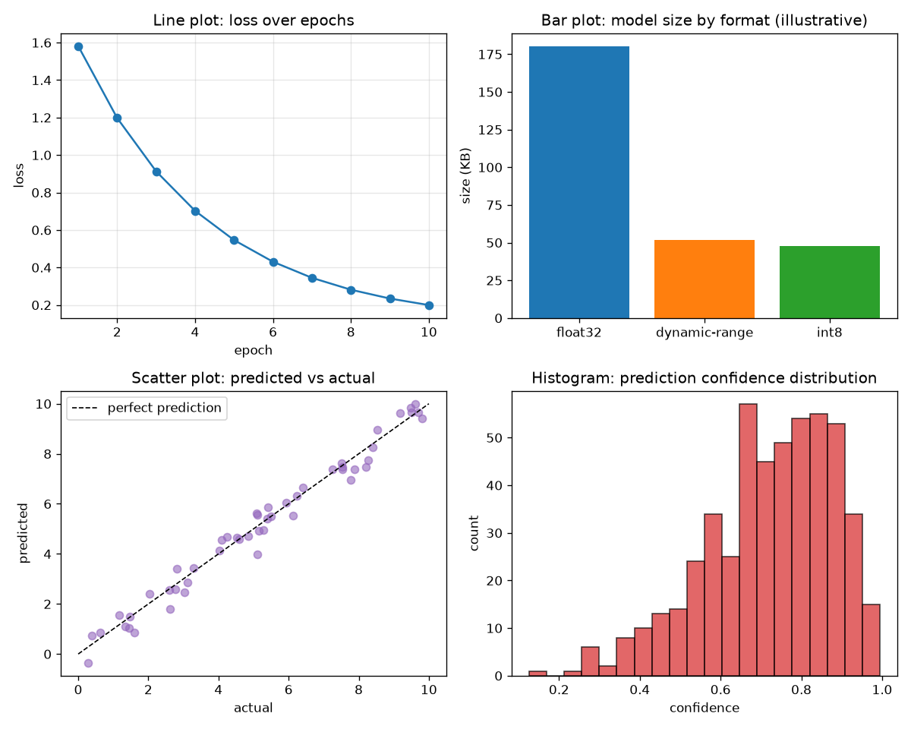
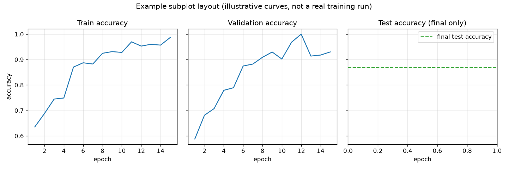
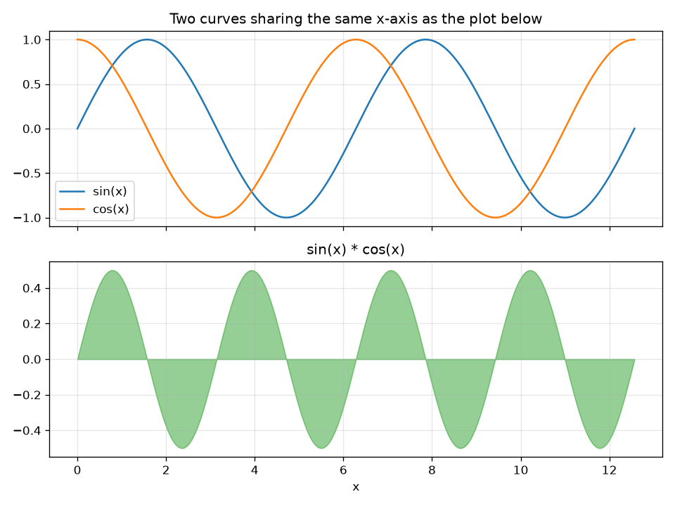
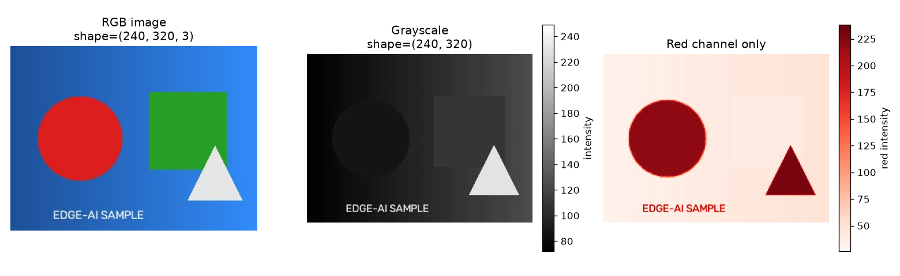
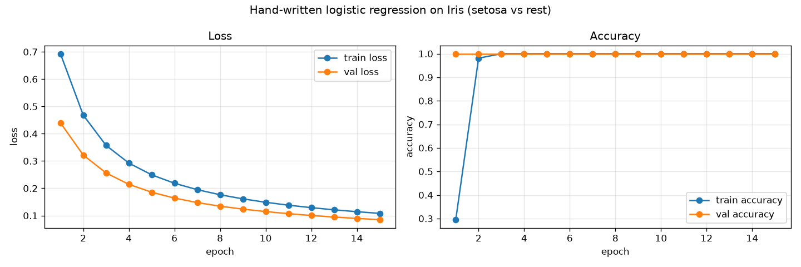

# matplotlib-practice

## Purpose

Plotting fundamentals needed to actually communicate results later: multi-panel
comparisons, image display with a colorbar, and one reusable function
(`plot_training_curves`) that gets imported again in `tensorflow-basics/` and
`final-project/`.

## Files

| File | Description | Output |
|---|---|---|
| `01_basic_plots.py` | Line, bar, scatter, histogram in a 2x2 grid. | `01_basic_plots.png` |
| `02_subplots.py` | Multi-panel figures: a shared-y 1x3 row and a shared-x 2x1 column. | `02_subplots.png`, `02_subplots_shared_x.png` |
| `03_image_display.py` | `imshow` on the shared sample image: RGB vs grayscale vs a single channel, with colorbars. | `03_image_display.png` |
| `04_training_curve_demo.py` | Reusable `plot_training_curves()`, demoed on a **real** dict of values from a hand-written logistic regression (plain NumPy gradient descent) trained here on real Iris data. | `04_training_curve_demo.png` |

## Key concepts covered

- `fig, ax = plt.subplots(...)` as the standard way to build multi-panel
  figures, including axis sharing (`sharex`/`sharey`).
- `imshow` + `colorbar` for visually verifying image preprocessing.
- Always `fig.savefig(...)` (not just `plt.show()`) so figures persist as
  repo artifacts.
- Writing a plotting function once (`plot_training_curves`) and reusing it
  across every later training run instead of re-writing plot code each time.

## How to run

```bash
python matplotlib-practice/01_basic_plots.py
python matplotlib-practice/02_subplots.py
python matplotlib-practice/03_image_display.py
python matplotlib-practice/04_training_curve_demo.py
```

## Output

### 01 — basic plot types


Note: the bar chart's size numbers here are placeholder/illustrative (labeled
as such in the title) — the *real* size/latency/accuracy comparison, measured
from actual `.tflite` files, is built in `tensorflow-lite/04_benchmark.py`.

### 02 — multi-panel layouts



### 03 — image display: RGB vs grayscale vs single channel


### 04 — training curve, from a real run


This is not a mocked-up curve. `04_training_curve_demo.py` trains a binary
logistic regression (`setosa` vs. everything else, real Iris data) with
gradient descent written by hand in plain NumPy, and plots the actual
per-epoch loss/accuracy it produced. It converges to 100% train/val accuracy
by epoch 3 — expected, since Iris-setosa is a famously linearly separable
class from the other two.

## Why this matters for Edge AI

A benchmark report is only as convincing as its charts. The exact bar-chart
pattern in `01_basic_plots.py` becomes the size/latency/accuracy comparison in
`tensorflow-lite/04_benchmark.py` — the single most important figure in this
repo. And `plot_training_curves()` is written once here and reused, so every
training run later (dense net on MNIST, CNN on Fashion-MNIST) produces a
consistent, comparable figure instead of one-off plotting code per script.

## Common mistakes / gotchas

- Forgetting `fig.tight_layout()` on multi-panel figures leaves axis labels
  overlapping neighboring subplots.
- `imshow` on a 2D array uses `cmap='viridis'` by default, which makes a
  grayscale image look like a heatmap unless `cmap='gray'` is passed
  explicitly (see `03_image_display.py`).
- `plt.close(fig)` matters in `plot_training_curves()` — without it, calling
  the function many times across a training-and-conversion pipeline leaks
  figure objects and memory.
- A perfectly separable class (Iris setosa) hitting 100% accuracy by epoch 3
  looks suspicious at first glance — it isn't a bug, it's a known property of
  that specific class split, and matters for judging whether a training curve
  "looks too good" versus recognizing an easy problem.
