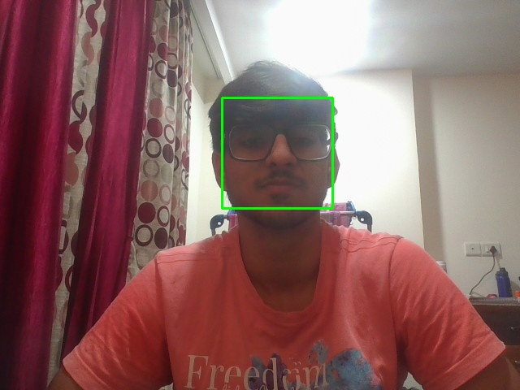

# mini-projects / face-or-object-detector

## Purpose

Face detection with OpenCV's Haar cascade classifier — a classical
(pre-deep-learning) technique that's genuinely relevant to edge deployment:
no GPU, no neural network interpreter, just fast image convolutions that run
in milliseconds on very modest hardware.

## Files

| File | Description |
|---|---|
| `detect.py` | Loads OpenCV's bundled `haarcascade_frontalface_default.xml`, runs `detectMultiScale` on an image (default: `test_photo.jpg`), draws boxes, saves the result. `--webcam` also runs live detection on a camera feed. |
| `test_photo.jpg` | A real photo captured from this machine's webcam (used with explicit approval — see above). |
| `detection_result.jpg` | Output: `test_photo.jpg` with a detected-face bounding box drawn on it. |

## How to run

```bash
python mini-projects/face-or-object-detector/detect.py                        # runs on test_photo.jpg
python mini-projects/face-or-object-detector/detect.py --image path/to/img.jpg
python mini-projects/face-or-object-detector/detect.py --webcam --max-frames 50  # also runs live detection
```

## Real result

```
Image: test_photo.jpg
Faces detected: 1
  face 0: x=273, y=120, w=136, h=136
```



**A real tuning problem, found and fixed by testing, not assumed:** the
commonly-quoted "default" Haar cascade parameters (`scaleFactor=1.1`,
`minNeighbors=5`) found **zero** faces in this photo — likely due to the
combination of eyeglasses and a bright backlit window behind the subject
reducing facial contrast. Testing several parameter combinations against the
real image found that `scaleFactor=1.05`, `minNeighbors=3` correctly detects
the face. `detect.py`'s docstring for `detect_faces()` explains the reasoning
and keeps the looser values as the default.

## Why this matters for Edge AI

Not every edge AI problem needs a CNN. Haar cascades are trained offline
once, then inference is pure classical image processing — no interpreter,
no quantization decisions, no `.tflite` file at all. For a task like "is
there a face in frame," this can be the right, cheaper answer versus running
a full neural network, especially on the most resource-constrained devices.
Knowing when *not* to reach for deep learning is as much a part of edge AI
engineering as the CNN pipeline in the rest of this repo.

## Common mistakes / gotchas

- Haar cascade "default" parameters from documentation/tutorials are not
  universal — they're tuned against whatever dataset the tutorial author
  used. Real deployment requires testing against real target images, exactly
  as done here (see the tuning story above).
- `opencv-python`'s newest major version (5.0.0.93) does not expose
  `cv2.CascadeClassifier` in its Python bindings at all — discovered while
  building this exact script. The whole repo's `opencv-python` pin was
  downgraded to `4.13.0.92` as a result; see
  `opencv-experiments/README.md`'s gotchas section for the full story,
  including a related Windows camera-backend fix this also surfaced.
- `detectMultiScale`'s `minSize` parameter matters more than it looks —
  without a sensible floor, the cascade searches for implausibly tiny "faces"
  in image noise/texture, which mostly wastes time rather than finding real
  false positives, but is worth setting deliberately rather than leaving
  unbounded.
