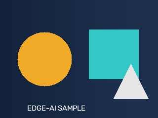
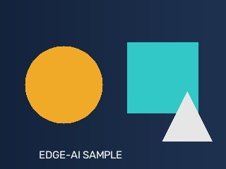
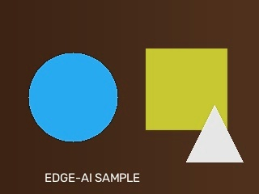
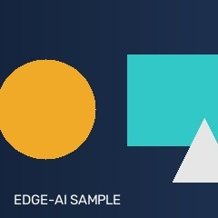
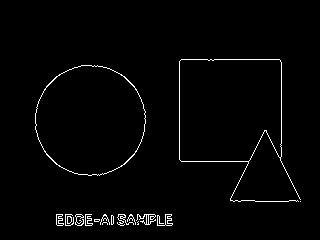
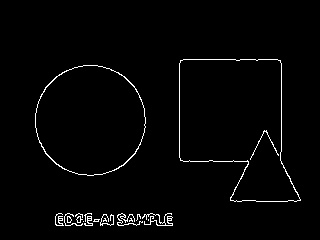

# opencv-experiments

## Purpose

OpenCV fundamentals needed to go from "an image file" to "a tensor a model
can consume" — the exact bridge `final-project/src/infer.py` and
`raspberry-pi/deploy_inference.py` depend on.

## Files

| File | Description |
|---|---|
| `generate_sample_image.py` | Generates the synthetic `sample.jpg` used across this whole repo (numpy-practice, matplotlib-practice, and every script below). Run once; the image is committed. |
| `01_read_display_save.py` | `imread`/`imwrite`, and a deliberate demonstration of the classic BGR-vs-RGB bug. |
| `02_resize_crop.py` | Resize with different interpolation methods, aspect-ratio-preserving resize-with-padding, and center cropping. |
| `03_color_grayscale.py` | `cvtColor`, fixed/Otsu/adaptive thresholding, HSV-based color masking. |
| `04_edge_detection.py` | Canny edge detection, blur-before-edges, and threshold sensitivity — with a real, honest (not staged) measurement. |
| `05_preprocess_for_model.py` | **The important one.** `preprocess_for_model()`: image path → resized → normalized → batched tensor, ready for a `tf.lite.Interpreter`. Reused verbatim later in the repo. |
| `06_webcam_capture.py` | `VideoCapture` loop with a graceful exit and a guard for "no camera available." |

## Why the sample image is synthetic

`sample.jpg` is generated by code (`generate_sample_image.py`), not
downloaded — a gradient background with a circle, rectangle, and triangle.
This keeps the repo self-contained (no internet dependency, no licensing
question) while still giving resize/crop/color/edge scripts real shapes and
real edges to work with.

## How to run

```bash
python opencv-experiments/generate_sample_image.py   # run once, generates sample.jpg
python opencv-experiments/01_read_display_save.py
python opencv-experiments/02_resize_crop.py
python opencv-experiments/03_color_grayscale.py
python opencv-experiments/04_edge_detection.py
python opencv-experiments/05_preprocess_for_model.py
python opencv-experiments/06_webcam_capture.py
```

## Output

### Sample image


### 01 — BGR vs RGB
Loading with `cv2.imread()` gives BGR order — pixel (10,10) reads as
`[60, 35, 19]` (B, G, R). After `cv2.cvtColor(BGR2RGB)` the same pixel reads
`[19, 35, 60]` — same numbers, reversed order. Saving an RGB array with
`cv2.imwrite` (which expects BGR) visibly shifts every color:

| Correct (BGR→BGR, as `imwrite` expects) | Wrong (RGB array passed to `imwrite`) |
|---|---|
|  |  |

### 02 — Resize and crop
Aspect-ratio-preserving resize with padding (no distortion) vs. a plain
center crop:

| Padded resize (128×128) | Center crop (240×240) |
|---|---|
|  |  |

### 03 — Grayscale, thresholding, color masking
| Grayscale | Otsu threshold (auto cutoff=106.0) | Orange color mask (9,465 px) |
|---|---|---|
|  |  |  |

### 04 — Edge detection
| No blur (1,465 edge px) | Blur first (1,543 edge px) |
|---|---|
|  |  |

**Real, measured result — reported honestly even though it wasn't what we
expected:** blurring first *increased* the edge pixel count on this image
(+78 px), the opposite of the usual "blur reduces noisy edges" story. That's
because this synthetic image has clean, hard geometric edges and zero sensor
noise — blur softened the anti-aliased boundaries just enough for Canny's
edge-linking step to connect a few more border pixels into continuous lines.
On a real noisy camera photo (the actual target case for this technique),
blur-then-Canny suppresses speckle noise that would otherwise register as
thousands of spurious edge pixels — this clean synthetic image simply has no
noise to demonstrate that benefit against. The mechanism is real; the
direction of the effect depends on what's actually in the image.

## Why this matters for Edge AI

`05_preprocess_for_model.py` is not a throwaway exercise — `preprocess_for_model()`
is imported directly by `raspberry-pi/deploy_inference.py` and
`final-project/src/infer.py`. Getting BGR/RGB, resize interpolation, and
normalization wrong here would silently corrupt every downstream prediction
without ever throwing an error — the model would just run inference on
garbage and report a confident, wrong answer. That failure mode (silent,
confident, wrong) is far more dangerous on an unattended edge device than a
crash would be.

## Common mistakes / gotchas

- **BGR vs RGB** — the single most common OpenCV bug when mixing it with
  matplotlib/TensorFlow/PIL, all of which expect RGB. It doesn't crash, it
  just silently produces wrong colors (see `01_read_display_save.py`).
- **`cv2.resize(img, (W, H))`** takes `(width, height)`, the *opposite* order
  from NumPy's `.shape` which reports `(height, width, channels)`. Easy to
  transpose by accident.
- Color contrast ≠ luminance contrast. The first version of `sample.jpg` used
  a red circle and green rectangle that were visually distinct in color but
  had nearly identical grayscale luminance to the background — Canny edge
  detection (which operates on grayscale gradients) almost completely missed
  them. Fixed by choosing colors with genuinely different luminance
  (`generate_sample_image.py`'s comments explain the reasoning). This was
  caught by actually looking at the output images, not assumed to be correct.
- `06_webcam_capture.py`'s `cap.isOpened()` check matters — on this
  development machine a webcam happened to be available and the capture loop
  ran for real (verified: 100 frames captured and released cleanly); passing
  an invalid camera index (tested with `camera_index=99`) correctly triggers
  the "no camera available" path instead of crashing. Both branches of this
  function have been exercised, not just assumed to work.
