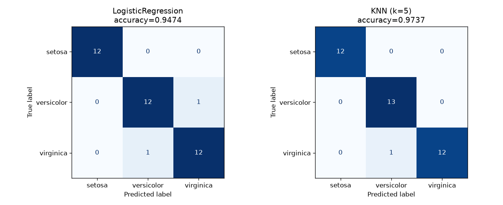
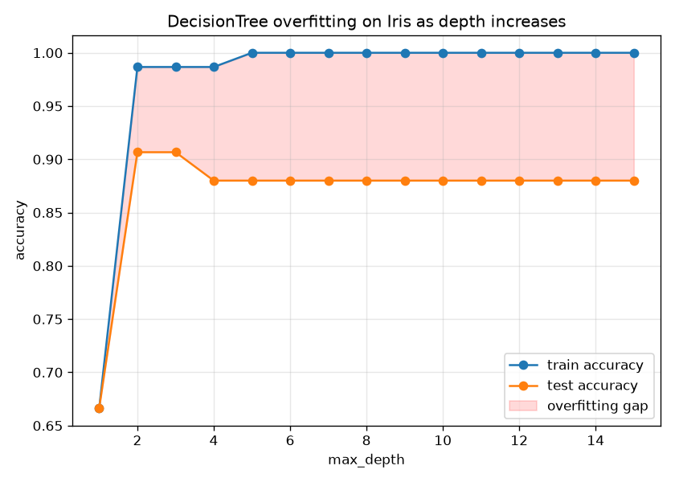

# scikit-learn-practice

## Purpose

Classical ML workflow end to end: regression, classification, why
preprocessing matters, and what overfitting actually looks like in numbers,
before moving to neural networks in `tensorflow-basics/`.

## Files

| File | Description | Output |
|---|---|---|
| `01_linear_regression.py` | `LinearRegression` on California Housing: MSE/RMSE/R², predicted-vs-actual plot. | `01_predicted_vs_actual.png` |
| `02_classification_iris.py` | `LogisticRegression` + `KNeighborsClassifier` on Iris: accuracy, confusion matrices. | `02_confusion_matrices.png` |
| `03_preprocessing.py` | `StandardScaler` on California Housing (binary "above-median value" task): accuracy and convergence with/without scaling. | (none) |
| `04_overfitting_demo.py` | `DecisionTreeClassifier` at increasing `max_depth` on Iris: train vs test accuracy gap. | `04_overfitting_curve.png` |

## How to run

```bash
python scikit-learn-practice/01_linear_regression.py
python scikit-learn-practice/02_classification_iris.py
python scikit-learn-practice/03_preprocessing.py
python scikit-learn-practice/04_overfitting_demo.py
```

## Results

**01. Linear regression** (California Housing, 20% test split):

| Metric | Value |
|---|---|
| MSE | 0.5559 |
| RMSE | 0.7456 (units of $100k) |
| R² | 0.5758 |

`AveBedrms` (+0.78) and `MedInc` (+0.45) had the largest positive
coefficients. `Latitude`/`Longitude` were both strongly negative, meaning
value drops moving north/east within this dataset's geographic range.

**02. Classification** (Iris, 25% test split, stratified):

| Model | Accuracy |
|---|---|
| LogisticRegression | 0.9474 |
| KNN (k=5) | 0.9737 |



**03. Scaling** (California Housing, binary "above-median value" task):

| | Accuracy |
|---|---|
| Without scaling | 0.8273 |
| With scaling | 0.8261 |

Final accuracy barely moved (-0.0012), but the unscaled run threw a real
`ConvergenceWarning` ("lbfgs failed to converge after 1000 iterations")
while the scaled run converged cleanly. The more useful lesson isn't the
couple points of accuracy, it's whether the solver reliably reached its
optimum at all. On features spanning `Population` (3 to 35,682) vs
`MedInc` (0.5 to 15), that isn't surprising.

**04. Overfitting** (Iris, 50% test split, DecisionTree):

| max_depth | train acc | test acc | gap |
|---|---|---|---|
| 1 | 0.6667 | 0.6667 | +0.0000 |
| 2 | 0.9867 | 0.9067 | +0.0800 |
| 5 | 1.0000 | 0.8800 | +0.1200 |
| 15 | 1.0000 | 0.8800 | +0.1200 |



Train accuracy hits 100% at `max_depth=5` and the tree keeps memorizing
further depth with zero benefit. Test accuracy plateaus at 0.88 and the
train/test gap stays flat at +0.12 for every depth beyond 5: classic
overfitting, where the extra depth after 5 buys nothing on unseen data.

## Why this matters for Edge AI

An overfit or poorly-preprocessed model doesn't announce itself; it just
quietly performs worse than validation metrics suggested once it meets real
input on device. `04_overfitting_demo.py`'s gap is exactly the check to run
before freezing any model's weights for conversion to TFLite. If train and
test accuracy have already diverged on a desktop with unlimited compute,
quantizing that same overfit model for a Pi doesn't fix it; it just ships
the same problem in a smaller file.

## Common mistakes / gotchas

- `StandardScaler.fit_transform()` must be called on train only,
  `.transform()` (not `.fit_transform()`) on test. Refitting on test data
  leaks test statistics into "training," inflating validation metrics.
- A `ConvergenceWarning` isn't just a nuisance to suppress. It means the
  reported coefficients/accuracy may not reflect the true optimum, and is
  worth reading rather than silencing.
- Stratified splitting (`stratify=y` in `02_classification_iris.py`) keeps
  class proportions equal between train/test. With only 150 Iris samples, a
  non-stratified split can noticeably skew a small test set.
- `DecisionTreeClassifier` with no `max_depth` limit will keep splitting
  until leaves are pure, which is why the overfitting curve here is entirely
  driven by one hyperparameter (`max_depth`); the same tree with
  regularization (`min_samples_leaf`, pruning) would look very different.
