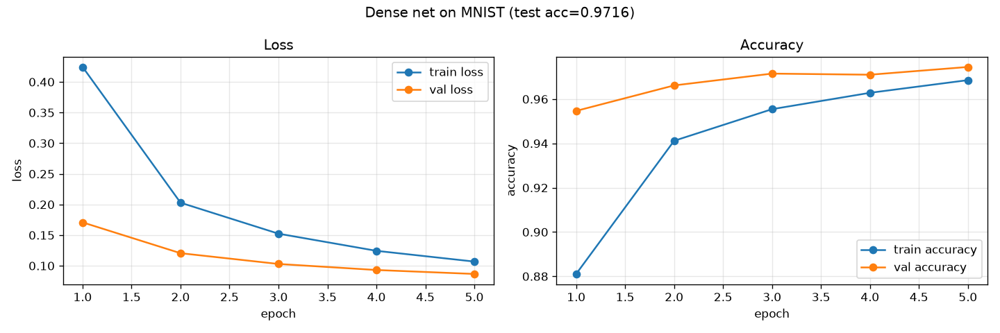
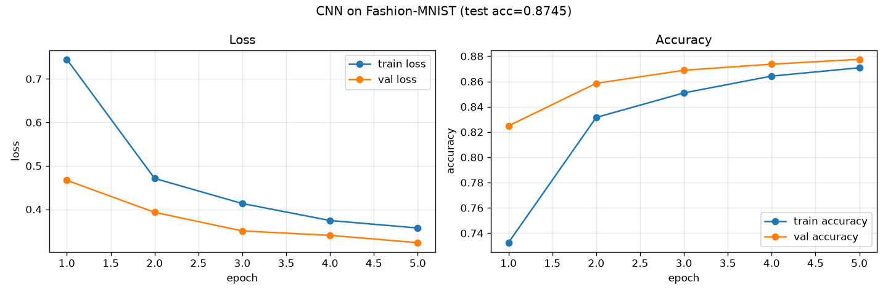

# tensorflow-basics

## Purpose

First real neural network training in this repo: tensors, a dense net on
MNIST, a small CNN on Fashion-MNIST, and model inspection. The Fashion-MNIST
CNN trained here (`fashion_mnist_cnn.keras`) is the exact model converted to
TFLite in `tensorflow-lite/` and deployed in `raspberry-pi/`.

## Files

| File | Description | Output |
|---|---|---|
| `01_tensors.py` | `tf.constant`, `tf.Variable`, shapes, dtype, casting, NumPy interop. | — |
| `02_first_nn_mnist.py` | Dense `Sequential` net on MNIST, 5 epochs. | `02_mnist_training_curve.png` |
| `03_cnn_fashion_mnist.py` | Small CNN on Fashion-MNIST, 5 epochs, saves the model. | `fashion_mnist_cnn.keras`, `03_fashion_mnist_training_curve.png` |
| `04_model_inspection.py` | `model.summary()`, per-layer parameter count, size estimation vs actual file size. | — |

## How to run

```bash
python tensorflow-basics/01_tensors.py
python tensorflow-basics/02_first_nn_mnist.py
python tensorflow-basics/03_cnn_fashion_mnist.py     # must run before 04
python tensorflow-basics/04_model_inspection.py
```

`02` and `03` download MNIST / Fashion-MNIST automatically via
`tf.keras.datasets` (small, cached after first download). Both scripts reuse
`plot_training_curves()` from `matplotlib-practice/04_training_curve_demo.py`
by importing it directly from its file path.

## Real results

**02 — Dense net on MNIST** (5 epochs, batch size 128, 10% validation split):

| Epoch | train acc | val acc | train loss | val loss |
|---|---|---|---|---|
| 1 | 0.8811 | 0.9547 | 0.4244 | 0.1708 |
| 3 | 0.9554 | 0.9715 | 0.1524 | 0.1029 |
| 5 | 0.9686 | 0.9745 | 0.1068 | 0.0867 |

**Final test accuracy: 0.9716**, test loss: 0.0948. Params: 101,770.



**03 — CNN on Fashion-MNIST** (5 epochs, batch size 128, 10% validation split):

| Epoch | train acc | val acc | train loss | val loss |
|---|---|---|---|---|
| 1 | 0.7325 | 0.8248 | 0.7451 | 0.4668 |
| 3 | 0.8509 | 0.8688 | 0.4134 | 0.3504 |
| 5 | 0.8708 | 0.8775 | 0.3571 | 0.3233 |

**Final test accuracy: 0.8745**, test loss: 0.3432.



Fashion-MNIST (clothing silhouettes) is a genuinely harder task than MNIST
(digits) — 87% vs 97% test accuracy on comparably small models/epoch budgets
is the expected gap, not a bug.

**04 — Model inspection** (on the trained Fashion-MNIST CNN):

| Layer | Type | Params |
|---|---|---|
| conv2d | Conv2D | 160 |
| conv2d_1 | Conv2D | 4,640 |
| dense | Dense | 51,264 |
| dense_1 | Dense | 650 |

**Total trainable parameters: 56,714.** The single `dense` layer (the one
right after `Flatten`) is **90.4%** of all parameters in the model — the two
convolutional layers combined are under 5,000 parameters. Estimated size at
float32 (4 bytes/param): 0.216 MB; at int8 (1 byte/param): 0.054 MB. Actual
`.keras` file on disk: 0.687 MB (larger than the raw weight estimate because
it also stores architecture and optimizer state — the `.tflite` conversion in
`tensorflow-lite/` strips that away).

## What a CNN layer is actually doing

A `Conv2D` layer slides a small grid of learned numbers (a filter, e.g. 3×3)
across the image and computes a weighted sum at every position — the same
filter, reused everywhere. That's why `conv2d` has only 160 parameters (16
filters × 3×3 × 1 input channel + 16 biases) but still produces a full
26×26×16 output: the parameters don't scale with image size, only with
filter size and channel count. `MaxPooling2D` then keeps the strongest
response in each 2×2 block, shrinking the spatial size while keeping the
signal that mattered. A `Dense` layer, by contrast, connects *every* input
to *every* output — which is exactly why the one `Dense(64)` layer after
`Flatten` (800 → 64 connections) costs more parameters (51,264) than both
convolutional layers combined (4,800).

## Why this matters for Edge AI

Parameter count is the number that determines whether a model fits in a
Raspberry Pi's RAM, how long it takes to load, and roughly how much compute
each inference costs — `04_model_inspection.py`'s finding that one `Dense`
layer holds 90% of the parameters is directly actionable: if this model
needed to be smaller, replacing `Flatten` + large `Dense` with
`GlobalAveragePooling2D` (which has zero parameters) would be the highest-
leverage change, before ever touching quantization. Quantization
(`tensorflow-lite/`) shrinks *existing* parameters; architecture choices like
this decide how many parameters exist in the first place.

## Common mistakes / gotchas

- Fashion-MNIST images are `(28, 28)` on load — a `Conv2D` layer needs a
  channel dimension, so `x_train[..., None]` (or `np.expand_dims(..., -1)`)
  is required before it'll fit the model's `Input(shape=(28, 28, 1))`. Easy
  to forget since the dense net in `02` doesn't need this.
- `sparse_categorical_crossentropy` (integer labels) vs
  `categorical_crossentropy` (one-hot labels) — using the wrong one either
  crashes with a shape error or silently trains against the wrong target.
- `model.count_params()` on a freshly `load_model()`-ed model includes
  optimizer state in `model.summary()`'s printed total if the optimizer was
  saved too — the per-layer breakdown in `04_model_inspection.py` is the
  number that actually matters for deployment size, not the summary's
  headline "Total params" line if it includes optimizer state.
- No GPU is used here (`TensorFlow GPU support is not available on native
  Windows for TensorFlow >= 2.11` — printed by TensorFlow itself, not
  suppressed) — everything in this repo runs and was measured on CPU, which
  is also the realistic target environment for a Raspberry Pi.
