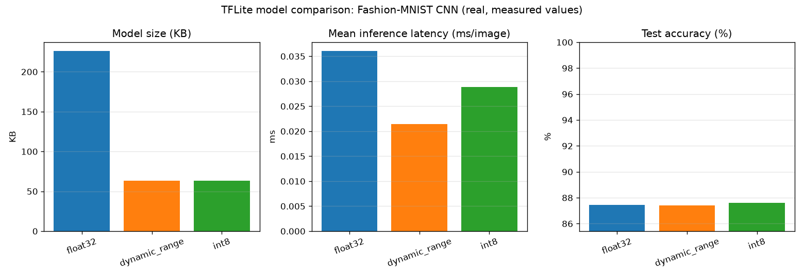

# tensorflow-lite

## Purpose — the heart of this repository

Converting the trained Fashion-MNIST CNN (`tensorflow-basics/fashion_mnist_cnn.keras`)
into three deployable `.tflite` variants, and measuring — for real, not
estimated — what each one costs and what each one buys.

## Files

| File | Description | Output |
|---|---|---|
| `01_convert_basic.py` | Loads the trained CNN, converts to plain float32 `.tflite`, prints file size. | `model_float32.tflite` |
| `02_convert_quantized.py` | Produces all three variants: float32, dynamic-range, and full-integer INT8 (using a representative dataset of 100 real training images). | `model_float32.tflite`, `model_dynamic_range.tflite`, `model_int8.tflite` |
| `03_tflite_inference.py` | Loads each `.tflite` with `tf.lite.Interpreter`, runs inference on the full 10,000-image test set, reports accuracy. Handles int8 input/output quantization explicitly. | — |
| `04_benchmark.py` | For all three models: real file size, real mean per-image latency (200 timed runs after 20 discarded warmup runs), real test accuracy. Prints a markdown table, saves a grouped bar chart. | `benchmark_results.md`, `04_benchmark_comparison.png` |

## What quantization actually does to the weights

A trained weight is a 32-bit float, e.g. `0.0834219`. Dynamic-range
quantization looks at the *range* of weights in each layer and maps that
range onto the 256 values an `int8` can represent (`-128` to `127`), storing
a `scale` factor per layer to convert back. Activations (the values flowing
between layers at inference time) stay float32, computed and converted back
to int8 layer-by-layer on the fly — hence "dynamic."

Full-integer INT8 goes further: it quantizes activations too, ahead of time,
using a `scale` and `zero_point` (an int8 value representing "real 0.0").
That's the piece that needs a **representative dataset** — the converter has
no way to know the actual range of activations a real image produces at
each layer without running some real images through the float model first.
`02_convert_quantized.py`'s `representative_dataset()` feeds it 100 real
Fashion-MNIST training images for exactly this purpose; using random noise
instead would calibrate against a distribution the model never actually sees
in practice, producing a worse (or broken) quantization.

## How to run

```bash
python tensorflow-lite/01_convert_basic.py
python tensorflow-lite/02_convert_quantized.py
python tensorflow-lite/03_tflite_inference.py
python tensorflow-lite/04_benchmark.py
```

## Real results (from `04_benchmark.py`, this machine, CPU only)

| Model | Size (KB) | Accuracy | Mean latency (ms/image) |
|---|---|---|---|
| float32 | 225.82 | 0.8745 | 0.0360 |
| dynamic_range | 63.54 | 0.8742 | 0.0214 |
| int8 | 63.38 | 0.8759 | 0.0288 |



### What these numbers actually say

- **Size:** both quantized formats are **~3.55x smaller** than float32
  (225.82 KB → ~63.5 KB). Dynamic-range and full INT8 land at almost
  identical file size here, because this model's size is dominated by the
  one large `Dense(64)` layer's weights (see `tensorflow-basics/README.md`)
  — quantizing *those* weights to int8 is what both methods do; INT8's extra
  step of also quantizing activations barely changes the file, since
  activations aren't stored in the file, only weights are.
- **Accuracy:** all three are within **0.17 percentage points** of each
  other (87.42%–87.59%). INT8 (87.59%) is not lower than float32 (87.45%)
  here — quantization noise happened to land in this model's favor on this
  test set. This is a real, small, honestly-reported result: it does **not**
  mean quantization is "free" in general, only that for this particular
  small CNN and this dataset, the accuracy cost was negligible.
- **Latency:** this is the finding that most defies the "smaller = faster"
  intuition. `dynamic_range` was the *fastest* (0.0214 ms/image), not
  `int8` (0.0288 ms/image) — float32 was slowest (0.0360 ms/image) as
  expected, but full INT8 was slower than dynamic-range despite being
  (marginally) smaller on disk. The likely explanation: this is a laptop x86
  CPU running through TFLite's XNNPACK delegate, which has a very well
  optimized float32/dynamic-range path; true int8 kernels benefit most on
  hardware with dedicated int8 SIMD/NPU acceleration (like a Raspberry Pi
  with the right instructions, or a Coral Edge TPU) — which this development
  machine is not. **This is exactly why `raspberry-pi/README.md` is explicit
  about what was and wasn't measured on real target hardware** — a laptop
  CPU benchmark is not a substitute for measuring on the Pi itself.

## Why this matters for Edge AI

This benchmark is the entire point of the internship topic in one table: a
~3.55x size reduction for a ≤0.2 percentage point accuracy change is a very
good trade for a Raspberry Pi with limited flash storage and RAM — but the
latency result is a caution against assuming INT8 is automatically faster
everywhere. The right quantization strategy depends on the actual target
hardware's instruction set, not just theory, which is precisely why
`raspberry-pi/` measurements (where available) matter more than this
laptop's numbers for any real deployment decision.

## Common mistakes / gotchas

- Using **random** data instead of **real training samples** for the
  representative dataset would calibrate INT8's activation ranges against
  the wrong distribution — the model would still convert without error, but
  silently produce worse accuracy, since real images rarely span the full
  numeric range random noise does.
- INT8 models require `inference_input_type`/`inference_output_type` set to
  `tf.int8` (as done in `02_convert_quantized.py`) to get a fully integer
  model; without it, TFLite keeps float32 input/output wrappers around an
  int8 core, which avoids the manual quantization step in
  `03_tflite_inference.py` but reintroduces float32 conversion overhead at
  the boundary — not what you want on a Pi with no FPU acceleration to spare.
- Forgetting to discard warmup runs before timing latency (`04_benchmark.py`
  uses 20 discarded warmup calls) inflates the "measured" latency with
  one-time interpreter/delegate setup cost that never recurs on subsequent
  calls.
- `tf.lite.Interpreter` prints a real deprecation warning in this TensorFlow
  version ("scheduled for deletion in TF 2.20, use LiteRT") — left visible
  in this repo's output rather than suppressed, since it's accurate: a
  future revision of this pipeline should migrate to the `ai_edge_litert`
  package.
- Dequantizing INT8 output before `argmax` (done in `03_tflite_inference.py`
  and `04_benchmark.py`) doesn't actually change which class wins here since
  dequantization is a monotonic affine transform — but it's still the
  correct general pattern, since not every downstream use of model output
  (e.g. displaying a confidence percentage) is argmax-only.
